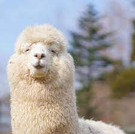

# **Muyun**

Hello! My name is Muyun. I'm the student of The Cross College Elite Program. I hope I can learn more about using R and Rstudio program in this class.

## My classmates said this animal is similar to me.

</a>

